# FinanceRPA

> 基于 Skyvern 二次开发的金融级 AI 浏览器自动化平台
> Java 后端 + Python AI 服务 + React 前端 的跨语言架构


FinanceRPA 用 LLM + 计算机视觉替代传统 XPath 脚本驱动浏览器，面向银行、保险、证券后台的高重复、强合规自动化场景（下载流水、填报保单、提交合规报告、对公信贷核验、监管报表等）。在 Skyvern 视觉决策能力之上，补齐了金融企业所需的**三维度权限、全链路审计、分级审批、LLM 韧性、多 Agent 协同、成本控制**等企业级能力，支持纯私有化部署，数据不出内网。

***

## 界面预览

### 认证与首页

<table>
  <tr>
    <td width="50%" align="center"><b>登录页</b><br>毛玻璃卡片 · 用户名/密码 · 过期提示</td>
    <td width="50%" align="center"><b>首页</b><br>欢迎区 + 快捷入口 + 用户/角色/权限</td>
  </tr>
  <tr>
    <td>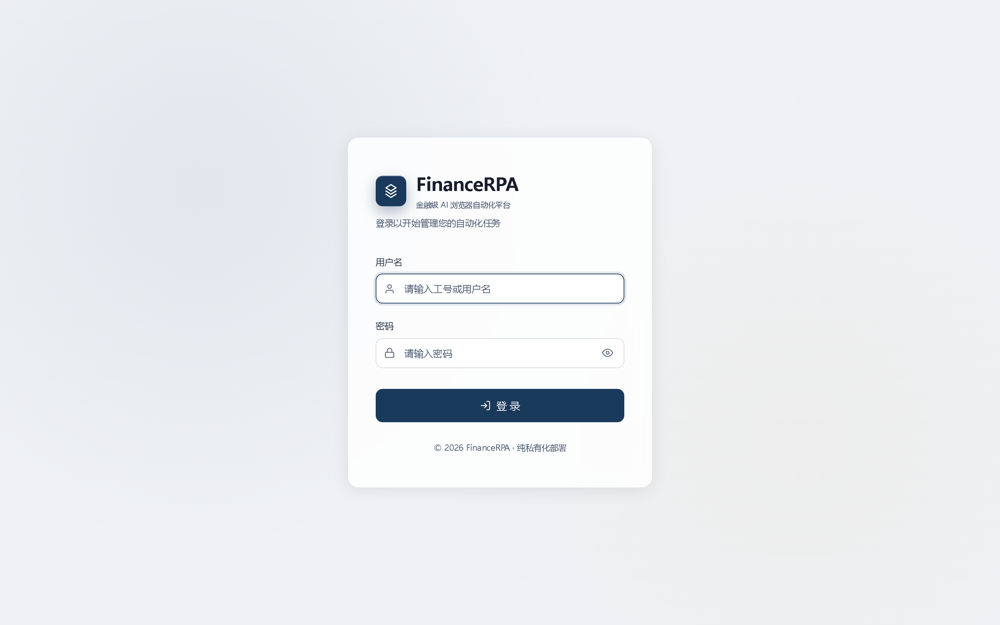</td>
    <td>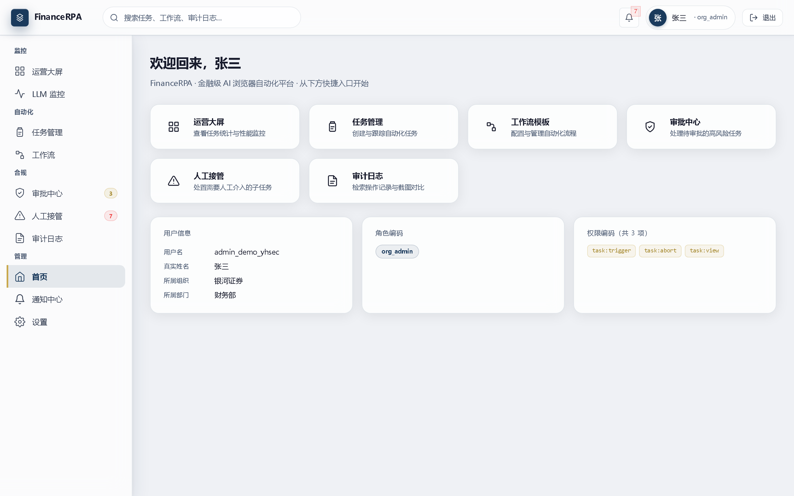</td>
  </tr>
</table>

### 监控

<table>
  <tr>
    <td width="50%" align="center"><b>运营大屏</b><br>KPI 卡片 + ECharts 趋势 + 业务线对比</td>
    <td width="50%" align="center"><b>LLM 调用监控</b><br>调用统计 · 按日趋势 · 调用记录</td>
  </tr>
  <tr>
    <td>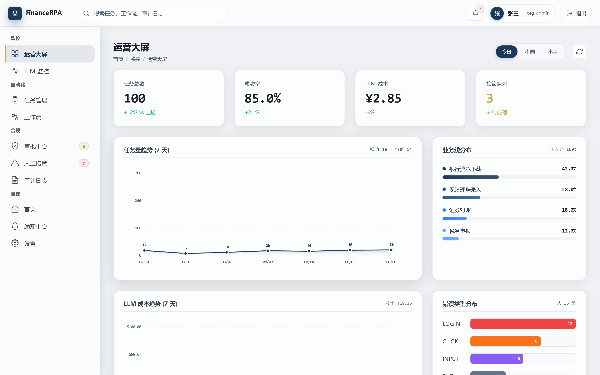</td>
    <td>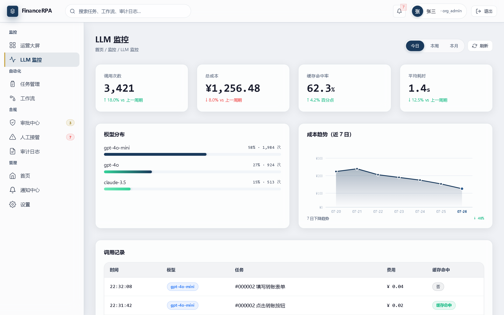</td>
  </tr>
</table>

### 自动化

<table>
  <tr>
    <td width="50%" align="center"><b>任务管理</b><br>分页 + 筛选 + 搜索 + 状态徽章</td>
    <td width="50%" align="center"><b>工作流模板</b><br>6 个金融场景模板 · 参数加密</td>
  </tr>
  <tr>
    <td>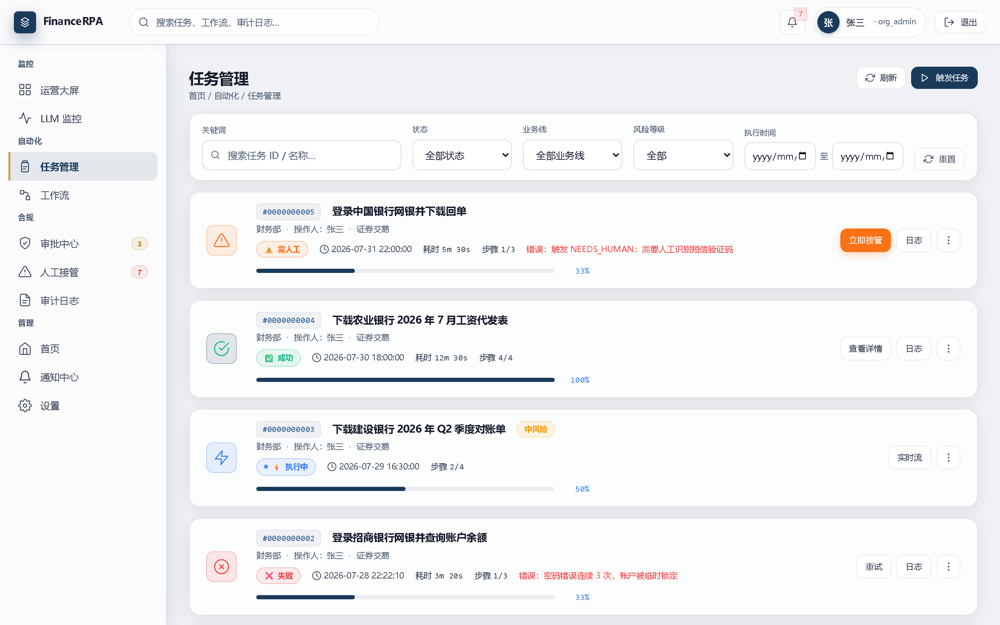</td>
    <td>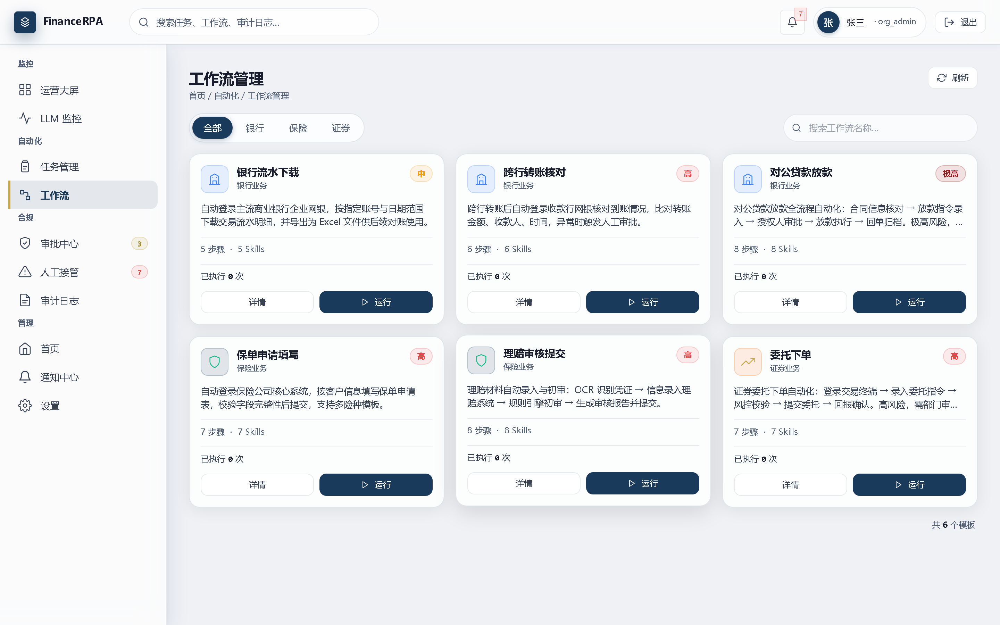</td>
  </tr>
</table>

### 合规

<table>
  <tr>
    <td width="50%" align="center"><b>审批中心</b><br>高风险任务审批 · 批准/拒绝</td>
    <td width="50%" align="center"><b>人工接管（NEEDS_HUMAN）</b><br>LLM 失败兜底 · 跳过/手动/终止</td>
  </tr>
  <tr>
    <td>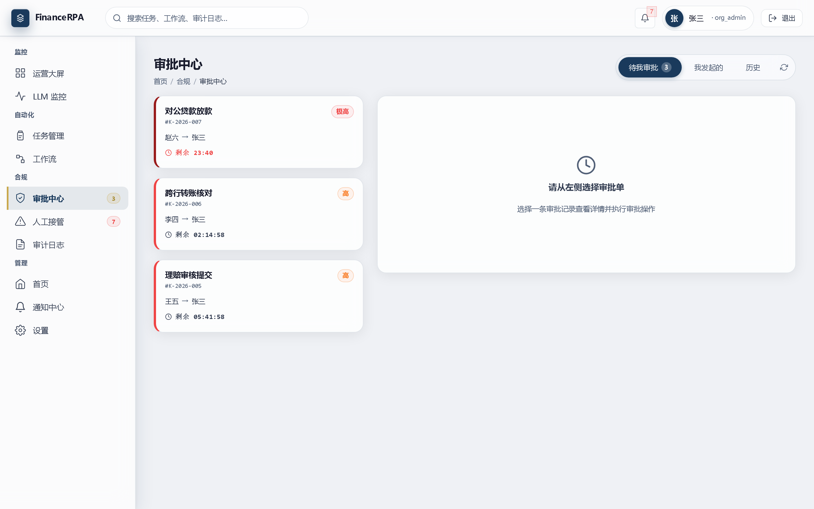</td>
    <td>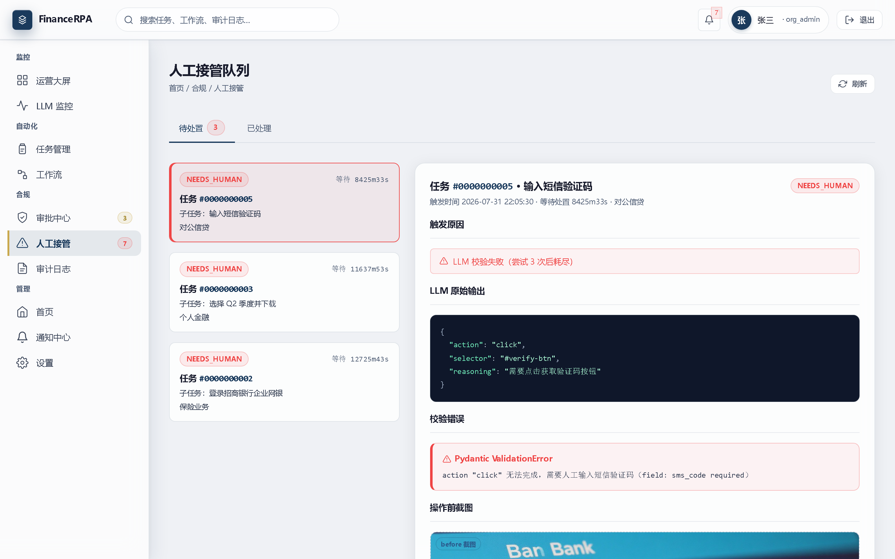</td>
  </tr>
  <tr>
    <td width="100%" align="center" colspan="2"><b>审计日志</b> · 多维检索 + 截图对比 + CSV 导出</td>
  </tr>
  <tr>
    <td colspan="2">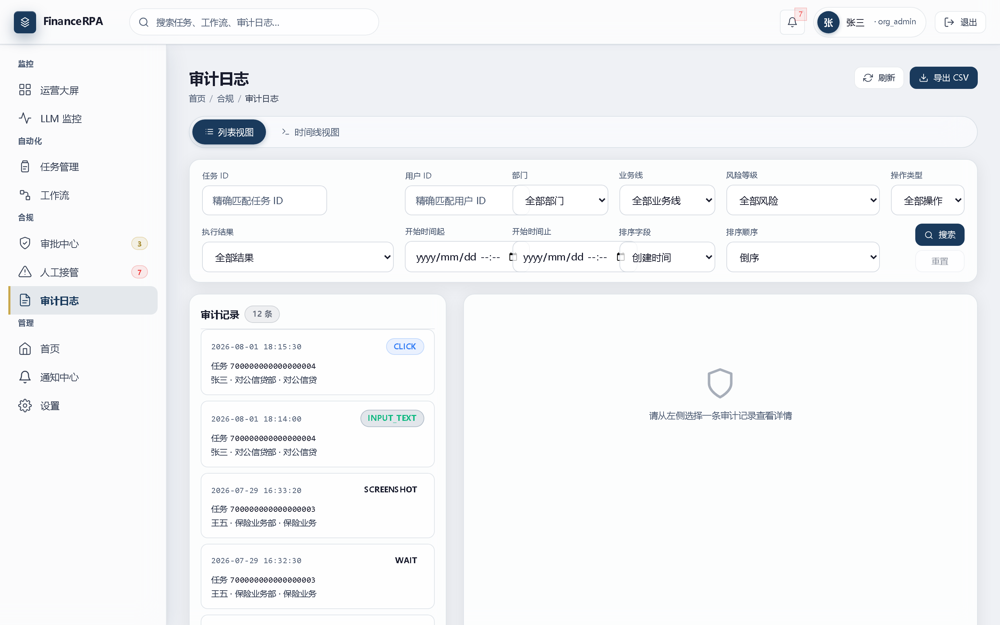</td>
  </tr>
</table>

### 管理

<table>
  <tr>
    <td width="50%" align="center"><b>通知中心</b><br>企业微信/钉钉 Webhook 通知</td>
    <td width="50%" align="center"><b>系统设置</b><br>用户/角色/通知通道/模板配置</td>
  </tr>
  <tr>
    <td>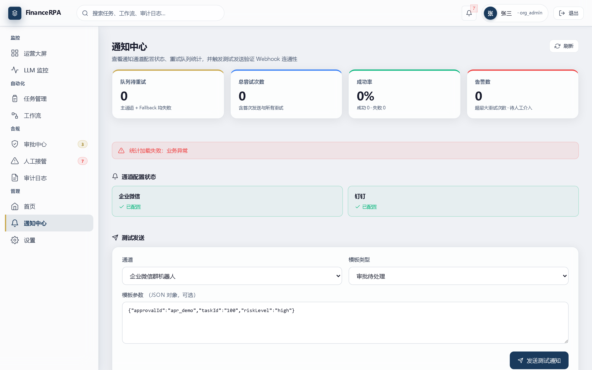</td>
    <td>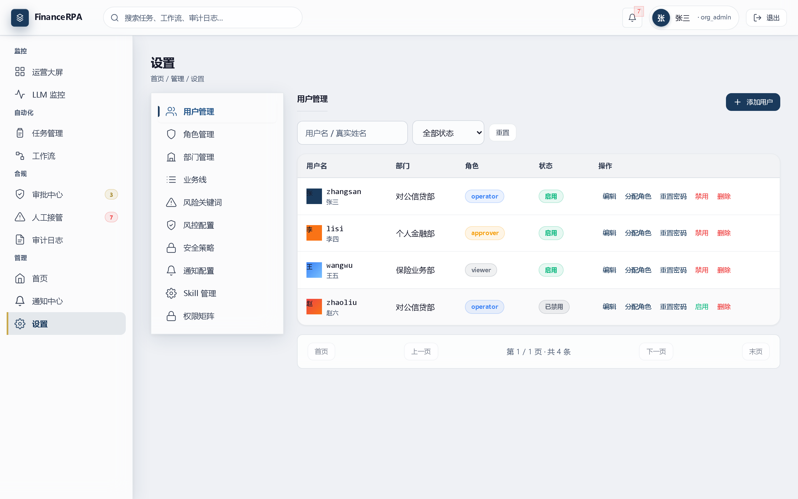</td>
  </tr>
</table>

***

## 核心特性

| 能力                | 说明                                                                              |
| ----------------- | ------------------------------------------------------------------------------- |
| **视觉驱动自动化**       | 基于 Skyvern + Playwright，LLM 视觉理解替代 XPath，页面改版不失效                                |
| **三维度 RBAC**      | 部门 × 业务线 × 角色，operator/approver 互斥，cross\_org\_read / cross\_org\_approve 跨组织权限 |
| **两阶段风险检测**       | 关键词预筛 + LLM 精准判断，low/medium/high/critical 分级路由审批                                |
| **全链路合规审计**       | 每步操作截图 + 元数据 + 脱敏 + MinIO 预签名 URL + CSV 导出 + 多维检索                               |
| **LLM 韧性**        | Prompt 格式约束 → Pydantic 校验重试 → NEEDS\_HUMAN 人工接管，三层容错                            |
| **双 Agent 协同**    | Planner 拆解 + Executor 执行 + Coordinator 编排，支持 replan 与断点续跑                       |
| **成本控制**          | Action 缓存（相同页面结构复用决策）+ 模型路由（按页面复杂度选模型），端到端延迟降低 41.6%                            |
| **Skill 库 + 工作流** | 7 个可组合 Skill + 6 个金融场景模板，参数 `{{param}}` 映射 + Fernet 加密                          |
| **实时浏览器流**        | SSE 推送 step / screenshot / reasoning，全链路透传到前端                                   |
| **纯私有化部署**        | Docker Compose 一键启动，Nginx 网关 + HTTPS 预留，数据不出内网                                  |

***

## 系统架构

***

## 技术栈

| 层次           | 技术                                                                                                                                           |
| ------------ | -------------------------------------------------------------------------------------------------------------------------------------------- |
| Java 后端      | Spring Boot 3.2 · JDK 21（虚拟线程）· MyBatis-Plus 3.5 · Flyway 10 · Spring Security 6 + jjwt + BCrypt + Fernet · Redisson 3 + Caffeine · ShedLock |
| Python AI 服务 | FastAPI · Skyvern + Playwright · LiteLLM + OpenAI/Anthropic SDK · SQLAlchemy 2.0 + Alembic · httpx · structlog                               |
| 前端           | React 18 + TypeScript · Vite + SWC · Tailwind CSS · Zustand + React Query · react-router-dom 6 · ECharts · @xyflow/react · 手写 SVG 图标         |
| 数据层          | PostgreSQL 16 · Redis 7 · MinIO                                                                                                              |
| 部署           | Docker Compose v2（开发 + 生产双配置）· Nginx 1.25（gzip + 安全头 + HTTPS + SSE 透传）                                                                       |
| 测试           | JUnit 5 + Mockito + AssertJ · pytest + pytest-asyncio · Vitest + Testing Library · Playwright（E2E）· JMeter（性能）                               |

> LLM 默认接入火山方舟豆包视觉模型（`ENABLE_VOLCENGINE`），亦可切换 OpenAI / Anthropic / Azure / 本地 Ollama。

***

## 项目结构

```
financeRPA/
├── finance-backend/        # Java 企业后端（Spring Boot 3.2）
│   └── src/main/java/com/finrpa/{auth,tenant,approval,audit,
│       dashboard,llm,agent,skills,workflows,notification,...}
├── finance-ai/             # Python AI 服务（FastAPI + Skyvern）
│   └── app/{agent,api,approval,audit,clients,llm,skills}/
├── finance-frontend/       # React 前端
│   └── src/{api,components,routes,store,styles}/
│   └── mock/mockServer.ts  # 内置 Mock Server（dev 模式默认启用）
├── tests/                  # 测试套件
│   ├── e2e/                # Playwright 端到端（6 个金融场景）
│   ├── sit/                # 系统集成测试
│   └── perf/               # 性能测试（Playwright + JMeter）
├── mock-bank/              # 模拟银行/保险/证券站点（E2E 验证用）
├── nginx/                  # Nginx 配置（开发 + 生产）
├── docs/                   # 需求 / 设计 / 部署 / 任务拆分文档
├── docker-compose.yml      # 开发环境
├── docker-compose.prod.yml # 生产环境 overlay
└── Makefile                # 开发命令快捷方式
```

***

## 快速开始

### 方式一：Docker Compose 一键启动（推荐）

```bash
# 1. 准备环境变量
cp .env.example .env
# 编辑 .env，至少填入 VOLCENGINE_API_KEY（火山方舟控制台获取）

# 2. 一键启动全部服务
docker-compose up -d

# 3. 等待健康检查通过（finance-ai 首次启动约 5 分钟）
docker-compose ps   # 期望所有服务 Up (healthy)

# 4. 访问
# 前端      http://localhost/
# 后端 API  http://localhost/api/actuator/health
# AI 服务   http://localhost/api/v1/ai/health
# MinIO     http://localhost:9001
```

### 方式二：本地开发（前后端分离调试）

```bash
# 中间件
docker-compose up -d postgres redis minio

# Java 后端（:8080）
cd finance-backend && ./mvnw.cmd spring-boot:run

# Python AI 服务（:8000）
cd finance-ai && uv run uvicorn app.main:app --host 0.0.0.0 --port 8000 --reload

# 前端（:5175，默认启用 Mock Server，无需后端即可预览 UI）
cd finance-frontend && npm install && npm run dev
```

> 前端 dev server 启用 Mock 时会拦截 `/api/` 请求返回 mock 数据，便于独立预览 UI 与调试 SSE。关闭 Mock：`VITE_USE_MOCK=false npm run dev`（需配合后端代理）。

更多命令见 `Makefile`（`make install / dev-backend / dev-ai / dev-frontend / test / seed`）。

***

## 演示账号

启动后端时 `DEMO_DATA_ENABLED=true` 会自动初始化演示数据（幂等）。

| 账号                    | 密码         | 角色         | 说明                |
| --------------------- | ---------- | ---------- | ----------------- |
| `admin`               | `admin123` | org\_admin | 默认管理员（V5 迁移脚本初始化） |
| `admin_demo_yhsec`    | `123456`   | org\_admin | 银河证券组织管理员         |
| `operator_demo_yhsec` | `123456`   | operator   | 操作员               |
| `approver_demo_yhsec` | `123456`   | approver   | 审批员               |
| `viewer_demo_yhsec`   | `123456`   | viewer     | 查看员（跨组织只读）        |

> 演示账号仅用于功能验证，不代表真实组织结构。生产环境务必通过系统设置页修改默认密码。

***

## 测试

| 层级                 | 目录                      | 命令                                      |
| ------------------ | ----------------------- | --------------------------------------- |
| Java 单元/集成         | `finance-backend`       | `cd finance-backend && ./mvnw.cmd test` |
| Python 单元          | `finance-ai/tests/unit` | `cd finance-ai && uv run pytest`        |
| 前端 lint            | `finance-frontend`      | `cd finance-frontend && npm run lint`   |
| E2E（6 个金融场景）       | `tests/e2e`             | `cd tests/e2e && npm test`              |
| 系统集成（SIT）          | `tests/sit`             | `cd tests/sit && npm test`              |
| 性能（单任务 / 并发 / SSE） | `tests/perf`            | `cd tests/perf && npm test`             |

***

## 文档导航

| 文档                                                             | 内容                         |
| -------------------------------------------------------------- | -------------------------- |
| [docs/requirements.md](docs/requirements.md)                   | 需求分析 · 市场分析 · 功能需求 · 非功能需求 |
| [docs/tech-stack.md](docs/tech-stack.md)                       | 技术选型 · 选型依据 · ADR 决策记录     |
| [docs/system-design.md](docs/system-design.md)                 | 系统设计 · 架构详设 · 数据模型         |
| [docs/task-breakdown.md](docs/task-breakdown.md)               | 任务拆分 · 里程碑 M0–M9 · 进度      |
| [docs/deployment.md](docs/deployment.md)                       | 生产部署指南 · HTTPS · 备份 · 故障排查 |
| [docs/settings-requirements.md](docs/settings-requirements.md) | 系统设置需求 · 用户/角色/通知配置        |
| [docs/perf-test-report.md](docs/perf-test-report.md)           | 性能测试报告                     |

***

## License

本项目基于 **MIT License** 开源。

```
MIT License

Copyright (c) 2026 TheChosenOne666

Permission is hereby granted, free of charge, to any person obtaining a copy
of this software and associated documentation files (the "Software"), to deal
in the Software without restriction, including without limitation the rights
to use, copy, modify, merge, publish, distribute, sublicense, and/or sell
copies of the Software, and to permit persons to whom the Software is
furnished to do so, subject to the following conditions:

The above copyright notice and this permission notice shall be included in all
copies or substantial portions of the Software.

THE SOFTWARE IS PROVIDED "AS IS", WITHOUT WARRANTY OF ANY KIND, EXPRESS OR
IMPLIED, INCLUDING BUT NOT LIMITED TO THE WARRANTIES OF MERCHANTABILITY,
FITNESS FOR A PARTICULAR PURPOSE AND NONINFRINGEMENT. IN NO EVENT SHALL THE
AUTHORS OR COPYRIGHT HOLDERS BE LIABLE FOR ANY CLAIM, DAMAGES OR OTHER
LIABILITY, WHETHER IN AN ACTION OF CONTRACT, TORT OR OTHERWISE, ARISING FROM,
OUT OF OR IN CONNECTION WITH THE SOFTWARE OR THE USE OR OTHER DEALINGS IN THE
SOFTWARE.
```

> 注：本项目二次开发了 [Skyvern](https://github.com/Skyvern-AI/skyvern)（AGPL-3.0）。Java 企业后端与 Python AI 服务通过 HTTP API 解耦，规避 AGPL 传染；`finance-ai/skyvern/` 目录下的 Skyvern 源码遵循其原始 AGPL-3.0 协议，使用时请遵守相应条款。

